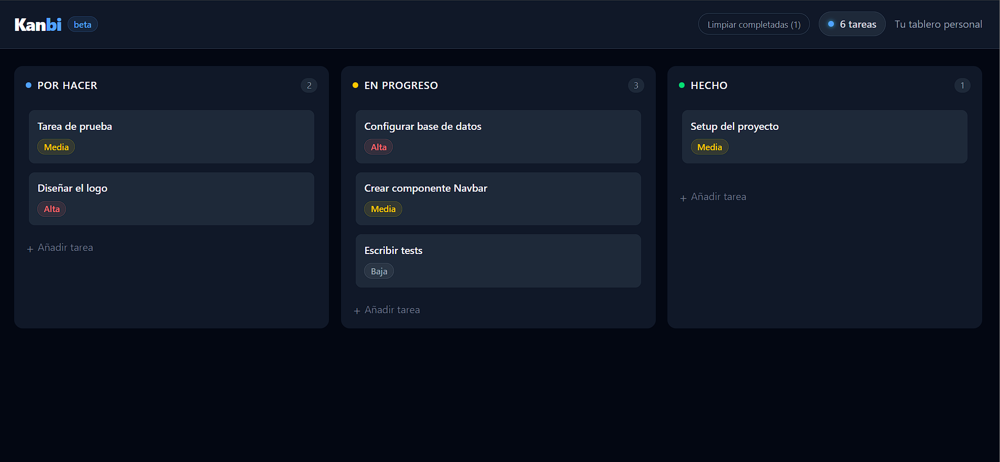

# Kanbi

Kanban board app built with React, Tailwind CSS and drag & drop.



## Features

- Drag & drop tasks between columns and within the same column
- Create tasks with priority levels (high, medium, low)
- Delete tasks with hover action
- Clear all completed tasks in one click
- Task counter in the navbar
- Data persistence with localStorage — tasks survive page refresh

## Tech stack

- React 19
- Vite
- Tailwind CSS v4
- @dnd-kit (drag & drop)
- Framer Motion (animations)

## Getting started

```bash
npm install
npm run dev
```

## Project structure

src/
├── components/
│   ├── Navbar.jsx      # Top bar with task counter
│   ├── Board.jsx       # Main board with state management
│   ├── Column.jsx      # Each kanban column
│   └── TaskCard.jsx    # Individual task card
└── App.jsx

## Live demo

[kanbi-topaz.vercel.app](https://kanbi-topaz.vercel.app)

---

Made by [Clara Montaño](https://github.com/claramontano)